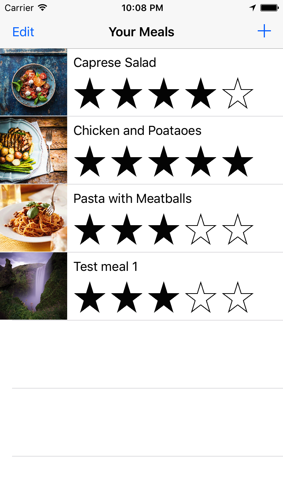
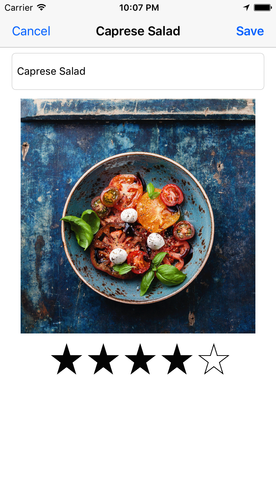
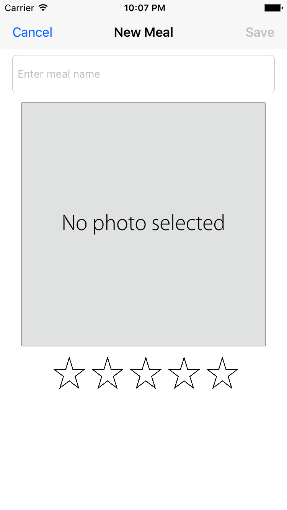

# FoodTracker
Tutorial from Start Developing iOS Apps (Swift) 
Simple meal-treaking app from here: https://developer.apple.com/library/content/referencelibrary/GettingStarted/DevelopiOSAppsSwift/index.html#//apple_ref/doc/uid/TP40015214-CH2-SW1

This app shows a list of meals, including a meal name, rating, and photo. A user can add, remove, or edit a meal. To add a new meal or edit an existing one, users navigate to a different screen where they can specify a name, rating, and photo for a particular meal.

  
  
    

